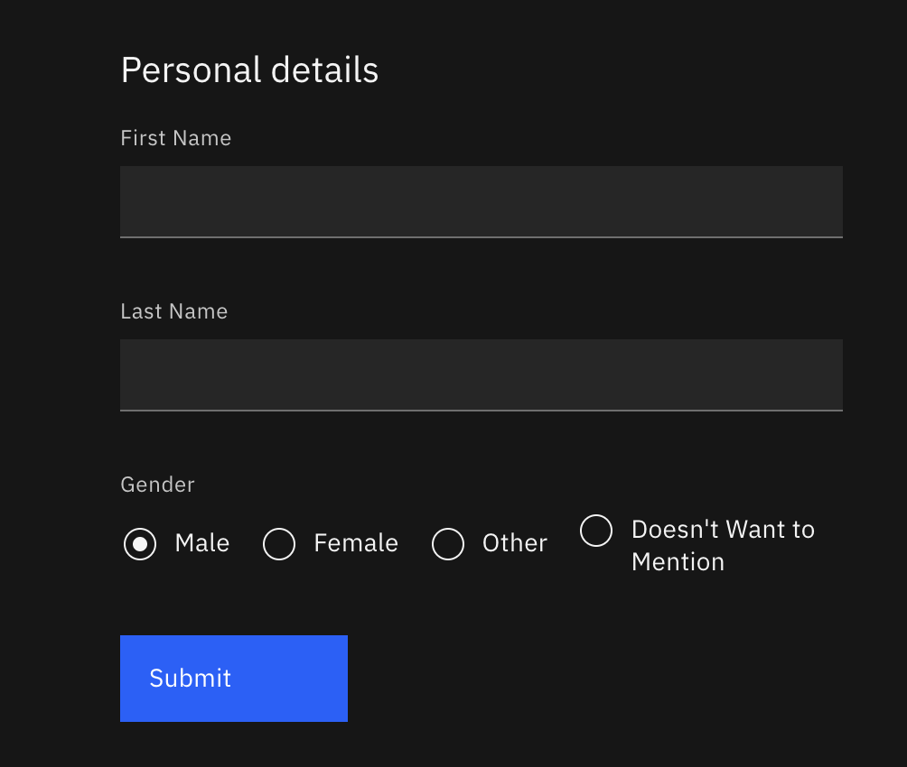
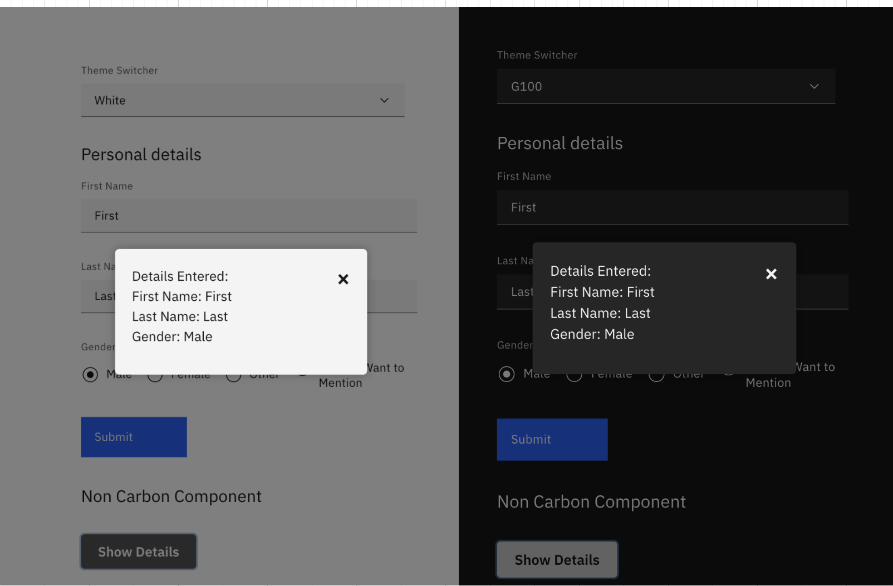

# Introduction

In today's UI landscape, theming is crucial for applications to seamlessly align with brand aesthetics and user preferences. Modern browsers and operating systems offer built-in light and dark mode support, making it essential for UI teams to ensure their applications adapt accordingly.

This guide delves into theming with IBM's Carbon React Library, a powerful tool that streamlines the process for React applications. We'll explore how to leverage Carbon's theming capabilities to meet diverse application requirements.

## Understanding IBM Carbon Desgin Library

Carbon is IBM's open-source design system that offers a comprehensive foundation for creating consistent, user-friendly digital experiences. Built upon the IBM Design Language, Carbon provides:

**Usable Code** : Ready-made React components and utilities for rapid development.

**Design Tools and Resources**: Assets, templates, and guidelines to maintain design consistency.

**Human Interface Guidelines**: Clear principles for user experience optimization.

**Active Community**: A network of contributors for collaboration and support.

For more details refer to [IBM Carbon Design Library](https://carbondesignsystem.com/all-about-carbon/what-is-carbon/)

## Theming for React Frontend Applications using IBM Carbon Design Library

Now that we understand the importance of theming, lets try to get theme set up using our own Carbon Design Library

Talking about theming there are a few terminologies with respect to the library that we need to understand before we proceed :

Theme - this is the aesthetic that you would want to apply to your application

Token - The above aesthetic for ui elements are enabled by a series of color tokens

Role  - The schematic way in which token should be applied

Value - The actual hex code that is assigned to the token

For more insights refer to [IBM Carbon themeing basics](https://carbondesignsystem.com/elements/themes/overview).

## Integrate theming into your React application using Carbon Library v11

## Prerequisites

**React Setup**: We assume you have a React project set up and is aware of React front end development. Through this tutorial we are using the react bolierplate, create-react-app with little tweeks that will be covered in below steps

**Development Environment**: For demostration, we are using macOS and Visual Studio Code as IDE, but the principles apply to any React application.

## Setting up boiler plate for theming

### Step 1: Create a React Project

  ```sh
  npx create-react-app carbon-theming-demo
  cd carbon-theming-demo
  ```

  Refer to <https://create-react-app.dev/> for detailed instructions.

### Step 2: Install Carbon Libraries

  ``` sh
  npm install @carbon/react @carbon/themes
  ```

### Step 3: Switch to SCSS Styling

Remove or rename existing .css files to .scss. If you want to preserve existing styles, carefully integrate Carbon's SCSS styles.
We'll demonstrate by creating a new scss file:

``` SCSS
@use '@carbon/react/scss/themes' as *;
@use '@carbon/styles';
@use '@carbon/themes';
```

With the above set up, there are different main ways in which each application would want to use theming within them.

1. Application should behave as per accessibility requirement when using default OS/ browser preference
2. Theme switching should be in the control of my application and not based on OS/ browser setting
3. I need my components to automatically pick up theme token when I use carbon library
4. I need to customize the theme token usage within my component based on the theme switcher

Our article covers how each of the above can be done in your application using IBM Carbon React Library

## Using System Preferences for Theme Switching

In many cases, you'll want the application to adapt to the user's system-defined light or dark mode preference as a default theming behavior. Carbon makes this easy. Add below to your entry point scss file.

``` SCSS
:root {
  @include themes.theme($white); /*Set default to white theme*/}
@media (prefers-color-scheme: dark) {
  :root {
    @include themes.theme($g100); /*Use dark theme for dark system preference*/}}
```

This code ensures your application starts in Carbon's white theme and switches to the dark theme ($g100) if the user's system prefers dark mode. If you are on MacOS, you can switch your prefered theme in Mac System Settings -> Appearance
You can update your browser specific theme as well. For example in Chrome -> Settings-> Appearance -> Mode, change it to 'Dark'.

Post the above, launch your application to view the theming taking into effect.

Lets get a bit detailed on Carbon Theming here.

Carbon offers four base themes:
white, gray 10, gray 90 , and gray 100

This is facilitated by using the appropriate color tokens, that would support the various color contrasts as per accessibility requirement

Along with these, custom theming can also be done via the library. For more details visit [here](https://carbondesignsystem.com/elements/themes/overview/#customizing-a-theme)

## Leveraging Carbon React Components

Carbon's React components automatically adapt to the active theme based on your system preferences or custom theming logic. Let's see this in action:

### Explore Carbon React Storybook

There are a variety of predesigned components available via this desgin library to ease the frontend development.
Browse the [Carbon React Storybook](<https://react.carbondesignsystem.com/>) to find various components usage examples and consume them in your application.

### Import and Use Components

In the source code example we are, importing form and its related components from `@carbon/react` to the entry point file - `App.js`, with necessary attributes

```js
import { FormGroup, Stack, TextInput, RadioButtonGroup, RadioButton, Button } from '@carbon/react';

function App() {
return (
<>
<header>
<title>Carbon Theming</title>
</header>
<body className="App-header">
<FormGroup className="form" legendText="Personal Details">
<Stack gap={7}>
<TextInput id="fn" labelText="First Name" />
<TextInput id="ln" labelText="Last Name" />
<RadioButtonGroup
legendText="Gender"
name="gender-radio"
defaultSelected="g1"
>
<RadioButton labelText="Male" value="M" id="g1" />
<RadioButton labelText="Female" value="F" id="g2" />
<RadioButton labelText="Other" value="O" id="g3" />
<RadioButton labelText="Doesn't Want to Mention" value="N" id="r4" />
</RadioButtonGroup>
<Button>Submit</Button>
</Stack>
</FormGroup>
</body>
</>);}

export default App;
```

With the above, run your app via `npm run start` to see the theme behaviour based on system setting

Here we are in Mac OS, updated the system preference to dark theme and below is the behaviour



## Add custom theme toggling option in your application

To add a custom theme toggling to your application, first design your component which would let you switch between the options [ either a dropdown /a radio button]

### Step 1

Here I am going to use carbon dropdown component from [here](https://react.carbondesignsystem.com/?path=/docs/components-dropdown--overview)
 Added a file `ThemeSelector.js` with the below to have the dropdown with react state management.

 Note : Exit your application if it is running before updating the code

 ```js
import { Dropdown } from '@carbon/react';
import { useState } from 'react';
import PropTypes from 'prop-types';

const availableThemes = [
  { label: 'White', value: 'white' },
  { label: 'G10', value: 'g10' },
  { label: 'G90', value: 'g90' },
  { label: 'G100', value: 'g100' },
];

const ThemeSelector = ({ handleSelectionChange }) => {
  const [selectedTheme, setSelectedTheme] = useState(availableThemes[0]);
  const handleThemeChange = ({ selectedItem }) => {
    setSelectedTheme(selectedItem);
    handleSelectionChange(selectedItem.value);
  };
  return (
    <Dropdown
      id="theme-dropdown"
      label="Theme Switcher"
      titleText="Theme Switcher"
      selectedItem={selectedTheme}
      items={availableThemes}
      onChange={handleThemeChange}
      itemToString={(item) => (item ? item.label : '')}
      style={{ width: '385px', marginBottom: '30px'}} 
    />
  );
};
ThemeSelector.propTypes = {
  handleSelectionChange: PropTypes.func.isRequired,
};

export default ThemeSelector;
 ```

### Step 2

Once you have it, lets add css attributes which would let us switch the theme in our scss file

```scss
[data-carbon-theme='g10'] {
 @include themes.theme($g10);
}
[data-carbon-theme='g90'] {
@include themes.theme($g90);
}

[data-carbon-theme='g100'] {
@include themes.theme($g100);
}
```

### Step 3

Now lets update HOC(Higher Order Component), here in App.js for the state changes to reflect the theming and add the theme effect

Refer to the source code for the component [here](https://github.com/npovatho/react-carbon-theme-demo/blob/main/src/App.js)

### Step 4

Launch your application by running `npm run start`

And you will be able to toggle the theme using the dropdown desgined

## Developing Themed Custom Components using Carbon Tokens

Instead of using carbon prestyled component, we can integrate the theme style switching to custom component.
Carbon has color tokens with specific names when applied will provide the desired color styling that would respect the theme in which the application is in.

Here we have a button custom component which opens a modal window, in which we are applying theme token to replicate the behaviour

The scss applied is where the difference is and it is as below

```css
@use '@carbon/styles';
@use '@carbon/react/scss/theme' as theme;

.customComponent {
  button {
    /* Base styles */
    color: theme.$text-inverse;
    background-color: theme.$icon-secondary;
```

The usage of tokens for the button color makes it to respect the theme used in the application



Note - source code for the blog is available [here](https://github.com/npovatho/react-carbon-theme-demo)


Authors : [Nimmy Povathody](npovatho@in.ibm.com), [Sowmya S](sowmya.s2@in.ibm.com)